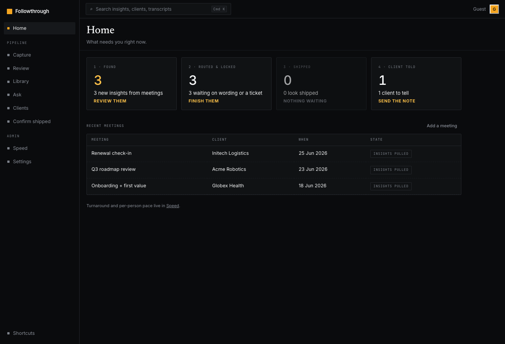
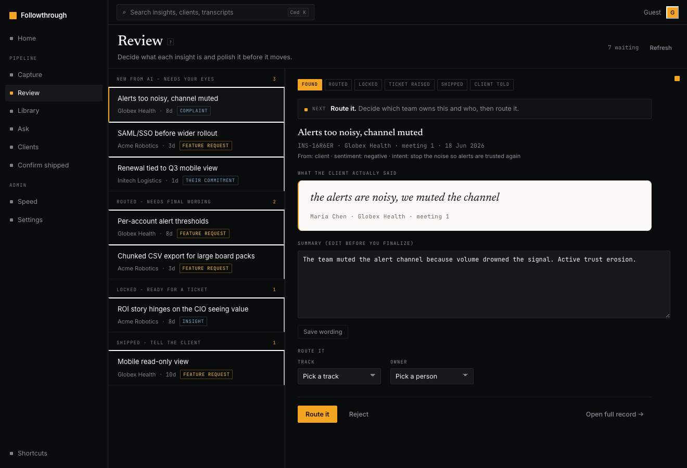
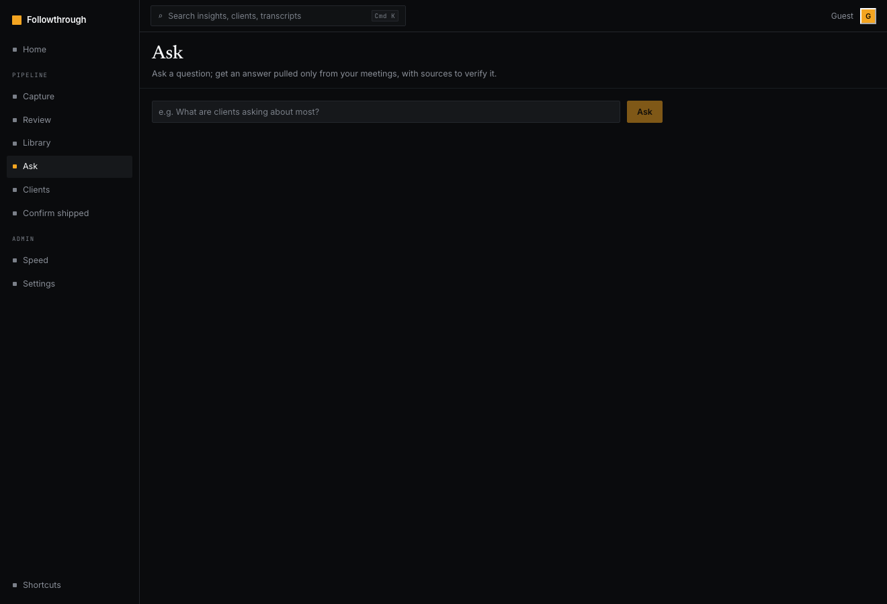
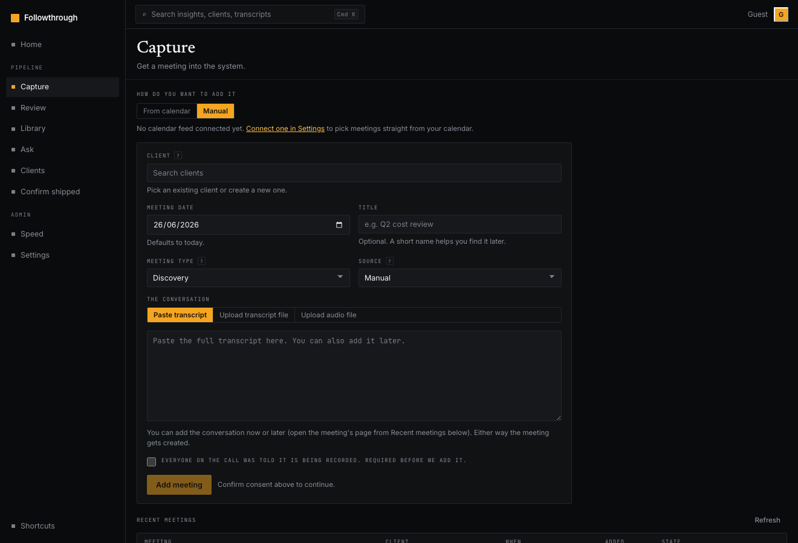
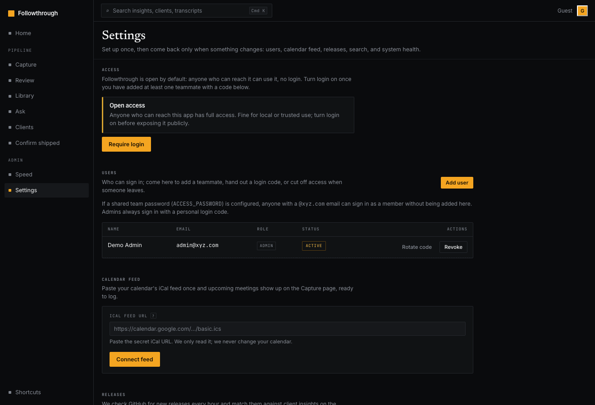
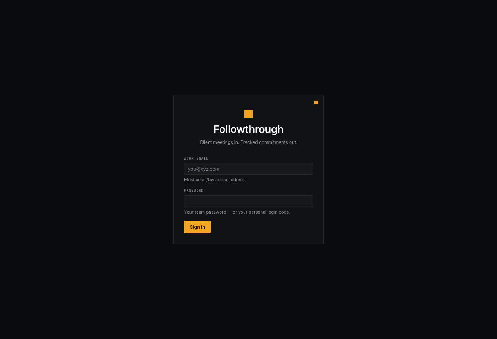

<div align="center">

# Followthrough

### Turn recorded client meetings into tracked, evidenced, closed-loop commitments.

[](LICENSE)
[](https://bun.sh)
[](https://www.typescriptlang.org/)
[](#development)
[](https://www.anthropic.com/)

*Meeting → extract → review → ticket → shipped → client told → closed. Every step timestamped.*

</div>

---

A salesperson promises a customer a feature on a call. Three weeks later it ships. Nobody tells the customer. The relationship quietly erodes. **Followthrough closes that loop.**

You feed it a meeting — transcript or audio. It extracts the real asks, complaints, and between-the-lines signals, each anchored to the client's exact words. A human reviews and polishes each one, routes it to a track, and moves it down a pipeline: ticket raised → proof it shipped → client told. Every transition is an event on an append-only log, so you can measure exactly how fast an ask travels from *said* to *shipped* to *told* — per client, per theme, per person.

> **The AI drafts; people decide.** Nothing reaches a client without a human confirming it. Every extracted insight must cite a verbatim quote from the transcript, or it doesn't exist.

> [!NOTE]
> The bundled sample meetings under `evals/golden/` are **fully synthetic** — every company, person, and product name is fictional.

---

## The pipeline

```
meeting ─▶ extract ─▶ review/finalize ─▶ ticket ─▶ shipped (proof) ─▶ client told ─▶ closed
            (AI)        (human gate)      (human)    (changelog match)   (email copy)
```

Each arrow is a tracked, timestamped state transition. The funnel, the turnaround times, and the per-client closed-loop rate all fall out of the event log for free.

---

## Screenshots

The "Transcript Spine" UI: cinematic dark chrome, a single signal-amber accent, editorial serif headers, and a single plain-English vocabulary.

| Home (what needs you now) | Review (triage workspace) |
|:---:|:---:|
|  |  |

| Ask (cited Q&A over your meetings) | Capture (get a meeting in) |
|:---:|:---:|
|  |  |

| Settings (open by default; login is optional) | Sign in (only when login is required) |
|:---:|:---:|
|  |  |

> Screenshots use synthetic demo data (fictional clients Acme / Globex / Initech). The bundled sample data is empty out of the box.

---

## Why it's different

| Most "meeting summarizers" | Followthrough |
|---|---|
| One-shot "summarize this call" → mush | Multi-pass, typed extraction with an independent verifier |
| Hallucinated takeaways | **Citation gate**: no verbatim quote, no insight — enforced programmatically |
| A summary you read once and lose | A pipeline that tracks each ask until the client is told |
| Auto-sends / auto-files | Human gate at every outward step; AI never contacts a client |
| Timestamps maintained by hand | Append-only event log is the single source of truth |
| Black-box "AI quality" | An eval flywheel that scores recall, precision & citation validity on every prompt change |

---

## Quick start

**Prerequisites:** [Bun](https://bun.sh) 1.3+. macOS or Linux.

```bash
git clone https://github.com/avinashgaurav/followthrough.git
cd followthrough
bun install

# Set your LLM key (one of these). Goes in .env, which is gitignored.
echo 'ANTHROPIC_API_KEY=sk-ant-...'    >> .env   # preferred (direct Anthropic)
# or
echo 'OPENROUTER_API_KEY=sk-or-...'    >> .env   # fallback, pinned to Claude, retention denied

# Tell the AI who it works for (see .env.example for every option)
echo 'PRODUCT_NAME=Acme'                 >> .env

# Build the web UI
bun run build:web

# Start the server (serves the API and the built UI on one port)
bun run start            # http://localhost:4500
```

The app serves on `http://localhost:4500` by default (set `PORT` to change it). **It's open by default** — no login required, and every visitor is an admin. Fine on your laptop; **turn on Require login before exposing it to the internet.** When you're ready to lock it down, go to **Settings → Access**, add a teammate (you get a one-time login code), then turn **Require login** on. Login is email + code. Any email can hold an account unless you set `ALLOWED_EMAIL_DOMAINS` (e.g. `acme.com`). You can also seed a first admin from the CLI with `bun run seed`.

<details>
<summary><b>Optional setup</b> (local transcription, backups, env vars)</summary>

```bash
# Local transcription for audio-only uploads — open source, no API key, audio never leaves your machine
bash scripts/setup-whisper.sh

# Nightly backups (SQLite snapshot + blob sync; restore notes in scripts/RESTORE.md)
bun run backup
```

| Env var | Purpose |
|---|---|
| `PORT` | server port (default `4500`) |
| `PRODUCT_NAME` | your company or product; the AI frames every insight and email around it (e.g. `Acme`) |
| `PRODUCT_DESCRIPTION` | one line on what you sell (e.g. `a payroll platform for SMBs`) |
| `ALLOWED_EMAIL_DOMAINS` | comma-separated domains allowed to hold accounts (e.g. `acme.com,acme.io`); unset = any email |
| `RELEASE_REPO` | `owner/name` of the GitHub repo whose releases are matched against client asks; unset = poller off (paste changelogs manually) |
| `WRITABLE_REPOS` | comma-separated `owner/name` repos the tool may create issues in; unset = direct creation off (copy-paste still works) |
| `BLOCKED_ORGS` | comma-separated GitHub orgs never written to, even if allowlisted |
| `GITHUB_READ_TOKEN` | poll a releases repo for changelog matching |
| `GITHUB_WRITE_TOKEN` | direct ticket creation in an allowlisted repo only |
| `DIGEST_WEBHOOK_URL` | Slack / Google Chat webhook for the weekly digest + nudges |
| `WATCH_DIR` | folder to auto-ingest dropped recordings |
| `DEEPGRAM_API_KEY` | cloud STT alternative to local whisper |
| `DEEPGRAM_KEYTERMS` | comma-separated terms to boost Deepgram accuracy (names, jargon) |
| `ACCESS_PASSWORD` | optional shared team password: any allowed-domain email + this signs in as a member. **Set `ALLOWED_EMAIL_DOMAINS` too**, or the password alone admits any email |

</details>

---

## How you use it — the tabs

The sidebar *is* the pipeline, top to bottom. Press `?` for shortcuts, `Cmd/Ctrl-K` for the command palette.

| Tab | What it's for |
|---|---|
| **Home** | The "what needs you right now" dashboard — the pipeline at a glance (found → routed → shipped → client told), recent meetings, and a jump straight into the queue. |
| **Capture** | Get a meeting in — from your calendar or manually. Type-ahead the client, confirm consent, paste a transcript or upload audio, then extract. |
| **Review** | The split-pane triage screen. Queue grouped by what needs you (*New from AI*, *Needs final wording*, *Ready for a ticket*, *Confirm it shipped?*, *Tell the client*). Polish, route, finalize. Brief-first: triage or reject many insights from one meeting in a single pass. `j`/`k` to move, `Enter` to open. |
| **Ask** | Ask a plain-English question and get an answer pulled **only** from your own meetings and insights, every claim cited back to the exact insight or transcript so you can verify it. No data leaves the pipeline. |
| **Insights** | Everything ever learned — filterable and searchable across transcripts and quotes. |
| **Clients** | Per client: meeting timeline, every open ask, the promise ledger, a one-click pre-call brief, CSV export for your CRM, and a shareable client-facing "you asked, we shipped" page. |
| **Meeting** | A single meeting's full readout — transcript, the brief, and every insight it produced, each attributed to a side (client vs us) with sentiment and intent. |
| **Proof** | When a release ships, the system proposes which client asks it closes — with changelog evidence and a confidence score. Confirm to mark *shipped* and unlock the client email. |
| **Numbers** *(admin)* | Turnaround times per stage, the funnel, what's stuck, demand by theme, per-person throughput, per-client closed-loop rate, AI quality. Every metric has a plain-words tooltip. |
| **Settings** *(admin)* | Access mode (open vs login-required), teammates, calendar feed, release polling, digest preview, rebuild search, and system health. |

---

## What makes the extraction good

One-shot summarization produces mush. The pipeline is multi-pass and verified (`src/extract/`):

1. **Clean & chunk** the transcript — handles hour-long calls; mixed English/Hindi quotes preserved verbatim.
2. **Typed extraction** — each item has a specific type (feature request, complaint, key insight, our action, their commitment) and captures the subtext: fears, internal politics, ROI pressure, frustration with incumbents. Each item is also attributed — **side** (client vs us, inferred from speaker labels + the attendee list), **sentiment**, and the client's underlying **intent**. The pass is deliberately selective: only decision-grade items, no small talk or restated points.
3. **Citation gate** — every item must carry a verbatim quote *programmatically verified to exist in the transcript*. No quote, no insight. This structurally kills hallucinations.
4. **Verifier pass** — an independent LLM judge drops items whose quote doesn't support the claim, or whose type is wrong.
5. **Dedup / merge** — a repeat ask attaches as a new mention on the existing insight (the "requested by N clients" signal) instead of a duplicate.
6. **Meeting brief** — a chief-of-staff synthesis: key readings, between the lines, lessons, action items grouped by owner team.

**The eval flywheel:** every human edit and discard during Review is captured. `evals/` drafts golden cases from your transcripts and scores recall, precision, citation validity, and type accuracy on every prompt change. See [`evals/README.md`](evals/README.md).

---

## Architecture

One runtime, one source of truth.

- **Bun + TypeScript** end to end — `Bun.serve` HTTP server, `bun:sqlite` database (WAL).
- **React + Vite** SPA in `web/`, served from `web/dist` by the same server. Dark-only, single-accent, `Cmd-K` command palette, vim-style keyboard nav.
- **The event log is the source of truth.** `events` is an append-only table (enforced by triggers); an insight's state is a *cache* rebuilt from it. Every turnaround-time metric is a query over the log — never a hand-maintained timestamp column. See `schema.sql` and `src/events.ts`.
- **LLM** — Anthropic direct (or OpenRouter pinned to Claude, retention denied). Structured outputs via Zod schemas. `src/llm/provider.ts`.
- **Storage** — metadata and transcripts in SQLite; audio/screenshots/CSVs as content-addressed blobs behind `media_assets` (local disk now, S3-ready).

<details>
<summary><b>Module map</b> (<code>src/</code>)</summary>

| Module | Responsibility |
|---|---|
| `auth`, `auth-routes` | email + login-code auth, optional shared-team password, sessions, rate-limited login, email-domain lock |
| `ingest` | clients, contacts, meetings, uploads, transcripts, dedup |
| `extract` | the multi-pass extraction pipeline + meeting brief |
| `insights` | triage, bulk triage/reject, finalize, merge, lifecycle, my-queue, full-text search, ask-your-memory (Q&A) |
| `tickets` | draft-first GitHub issues; org-safety write allowlist |
| `evidence`, `emails` | completion evidence (all tracks) and client follow-up drafts |
| `releases` | release poller + manual changelog intake + matcher + confirm queue |
| `share` | tokenized, public client-facing "you asked, we shipped" page |
| `metrics`, `exports`, `digest` | admin dashboard, CSV export, weekly digest |
| `notify` | fire-and-forget Slack / Google Chat nudges (extraction + daily summary) |
| `calendar` | read-only iCal intake for capture prefill (with SSRF guard) |
| `stt` | transcription — local whisper.cpp, or Deepgram cloud STT when a key is set |
| `watchfolder`, `retention` | folder auto-ingest; consent/deletion purge |

</details>

---

## Safety, by construction

- **Never writes to a protected GitHub org.** Direct ticket creation only reaches repos in `WRITABLE_REPOS`, and orgs in `BLOCKED_ORGS` are refused even if listed. Both are read at startup; there is no runtime override. Tickets are draft-first.
- **Consent gate.** A meeting can't be processed until consent is confirmed at upload.
- **No auto-send.** The confidence score only *suggests* "shipped"; a human confirms before any client email exists. Copy-to-clipboard is the send proxy, and the copy moment is the tracked timestamp.
- **Retention.** A meeting can be purged (audio, transcript, derived quotes) while keeping the insight record. `DELETE /api/meetings/:id`.

---

## Development

```bash
bun run dev            # server with --watch
cd web && bun run dev  # vite dev server, proxies /api to :4500
bun test               # 311 tests
bunx tsc --noEmit      # typecheck
bun run evals          # extraction quality scoring (needs an LLM key)
```

The full product contract lives in [`SPEC.md`](SPEC.md). Design references are in [`design-reference/`](design-reference/).

---

## License

[MIT](LICENSE) © 2026 Avinash Gaurav
